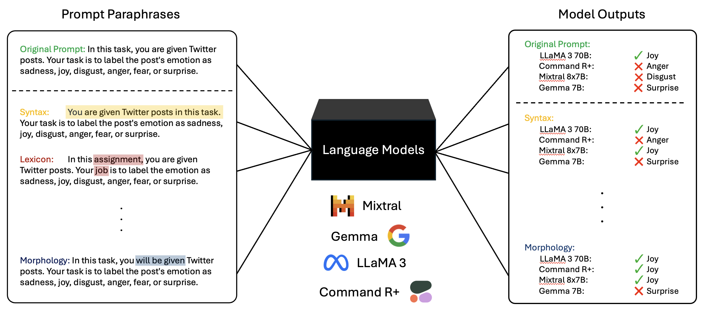

# Paraphrase Types Elicit Prompt Engineering Capabilities
[](https://arxiv.org/abs/2310.14863)



## Overview
This repository provides the implementation of the paper "Paraphrase Types Elicit Prompt Engineering Capabilities".

## Data
The main tasks of this study are from the [SuperNatural-Instruction](https://github.com/allenai/natural-instructions) dataset, which is available under `/data`.

## Scripts and Usage

### Paraphrase Prompts and Run Tasks
Run the main script `paraphrase_and_run_tasks.py` to generate paraphrases and execute tasks.

### Index FineWeb Dataset
Use the `build_bm25_index.py` script to index the FineWeb corpus using the BM25 algorithm.

### Analyzing the Results
To compute gains and losses, and measure lexical diversity, use `analysis_gain_loss_lexical_diversity.py`.

Evaluate the complexity of prompts with `analysis_complexity.py`.

Assess the closeness of prompts to the training data using `analysis_closeness_to_training.py`.

## Contributing
You can contribute by reviewing source code changes and adding new features.

## Citation

```bib
@inproceedings{wahle-etal-2023-paraphrase,
    title = "Paraphrase Types for Generation and Detection",
    author = "Wahle, Jan Philip  and
      Gipp, Bela  and
      Ruas, Terry",
    editor = "Bouamor, Houda  and
      Pino, Juan  and
      Bali, Kalika",
    booktitle = "Proceedings of the 2023 Conference on Empirical Methods in Natural Language Processing",
    month = dec,
    year = "2023",
    address = "Singapore",
    publisher = "Association for Computational Linguistics",
    url = "https://aclanthology.org/2023.emnlp-main.746",
    doi = "10.18653/v1/2023.emnlp-main.746",
    pages = "12148--12164",
    abstract = "Current approaches in paraphrase generation and detection heavily rely on a single general similarity score, ignoring the intricate linguistic properties of language. This paper introduces two new tasks to address this shortcoming by considering paraphrase types - specific linguistic perturbations at particular text positions. We name these tasks Paraphrase Type Generation and Paraphrase Type Detection. Our results suggest that while current techniques perform well in a binary classification scenario, i.e., paraphrased or not, the inclusion of fine-grained paraphrase types poses a significant challenge. While most approaches are good at generating and detecting general semantic similar content, they fail to understand the intrinsic linguistic variables they manipulate. Models trained in generating and identifying paraphrase types also show improvements in tasks without them. In addition, scaling these models further improves their ability to understand paraphrase types. We believe paraphrase types can unlock a new paradigm for developing paraphrase models and solving tasks in the future.",
}
```

## License
Licensed under the Apache 2.0 license.
